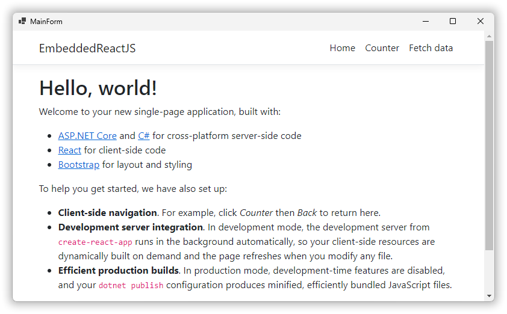

# EmbeddedReactJS
Embedding ReactJS application inside WinForm app with WebView2

# Resources
* https://www.codementor.io/@gabrieleferreri/write-a-desktop-app-with-react-typescript-asp-net-core-and-webview2-1irclqmu8f
* https://learn.microsoft.com/en-us/microsoft-edge/webview2/

The article was a little dated(a whopping 2 years old!), this is the .NET 6 version, but 99.9% of the code is from that article.  This idea starts it's life out as the asp.net react app template for Visual Studio. That application then is slightly modified to be a windows forms app, adding [WebView2](https://learn.microsoft.com/en-us/microsoft-edge/webview2/) control allows the hosting of the react app, so that at the end of the day, you have a WinForm app, hosting a ReactJS app that hitting an ASP.NET api, all in the same code base.  

I can see this being pretty handy in hybrid applications.  This demo starts the dev server to host the react app but I can see bundling the react app with the WinForm app just as static html(you can load static html in a WebView2 control), and then periodically checking for app updates online...just an idea.

